# Mandelbrot 1989

In 1989 I was swept up in the Mandelbrot Set craze. A friend and colleague of my Mum's, Felix Wedgwood-Oppenheim, was visiting with his family (or perhaps we were visiting them in Birmingham - I can't remember). He knew I liked computers, so he showed me the basic maths behind computing this weird thing called the Mandelbrot Set - I had never heard of it, of course. I still have some of the notes that he wrote for me that day:

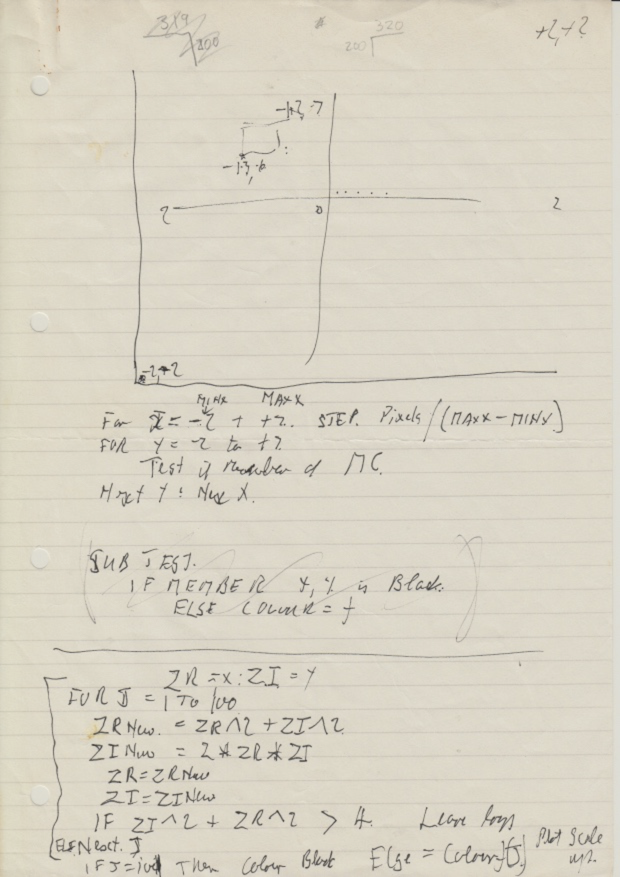

I was hooked, and spent the next few months writing programs to explore the Mandelbrot Set on my Atari ST. On this page I have included some of the programs that I wrote and the plots that I produced. I have also successfully run one of the programs on a modern Atari ST emulator.

## Programs

I wrote the programs in GFA Basic. I think it was version 2, but I know I upgraded to version 3 at some point, so some of the programs may have been for that version. My re-creation of one of the programs uses GFA Basic 3.

Here is the main `Mandelbrot` procedure, which I scanned in from a printout:

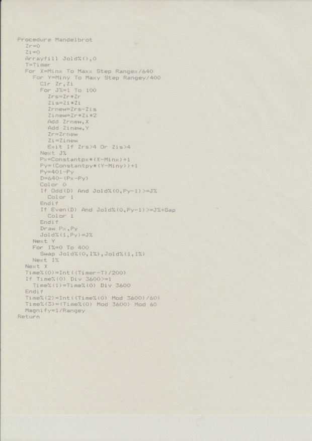

I have retyped it to make it easier to read:

```
Procedure Mandelbrot
  Zr=0
  Zi=0
  Arrayfill Jold%(),0
  T=Timer
  For X=Minx To Maxx Step Rangex/640
    For Y=Miny To Maxy Step Rangey/400
      Clr Zr,Zi
      For J%=1 to 100
        Zrs=Zr*Zr
        Zis=Zi*Zi
        Zrnew=Zrs-Zis
        Zinew=Zr*Zi*2
        Add Zrnew,X
        Add Zinew,Y
        Zr=Zrnew
        Zi=Zinew
        Exit If Zrs>4 Or Zis>4
      Next J%
      Px=Constantpx*(X-Minx)+1
      Py=(Constantpy*(Y-Miny))+1
      Py=401-Py
      D=640-(Px-Py)
      Color 0
      If Odd(D) And Jold%(0,Py-1)>=J%
        Color 1
      Endif
      If Even(D) And Jold%(0,Py-1)>=J%+Gap
        Color 1
      Endif
      Draw Px,Py
      Jold%(1,Py)=J%
    Next Y
    For I%=0 To 400
      Swap Jold%(0,I%),Jold%(1,I%)
    Next I%
  Next X
  Time%(0)=Int((Timer-T)/200)
  If Time%(0) Div 3600>=1
    Time%(1)=Time%(0) Div 3600
  Endif
  Time%(2)=Int((Time%(0) Mod 3600)/60)
  Time%(3)=(Time%(0) Mod 3600) Mod 60
  Magnify=1/Rangey
Return
```

The code is fairly self-explanatory. The variables are initialized elsewhere, but it's easy to guess what they mean. The meaning of `D` might be unclear: it is used to indicate which diagonal a pixel lies on. The reason for this is the slightly unusual rendering scheme that I used for the plots.

Like many computers of the time, the ST had different graphics modes that allowed you to choose trade-offs between resolution and number of colours. For example, low resolution was 320 by 200 pixels with 16 colours, whereas high resolution was 640 by 400 pixels but with only two colours (black and white). I wanted the plots to have the highest resolution, so I used a "shadow" rendering technique that I had read about in A. K. Dewdney's [June 1989 Computer Recreations Column in Scientific American](https://www.scientificamerican.com/article/computer-recreations-1989-06/):

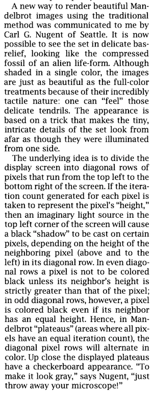

This way I could get high resolution plots of the Mandelbrot Set. Here is an example:

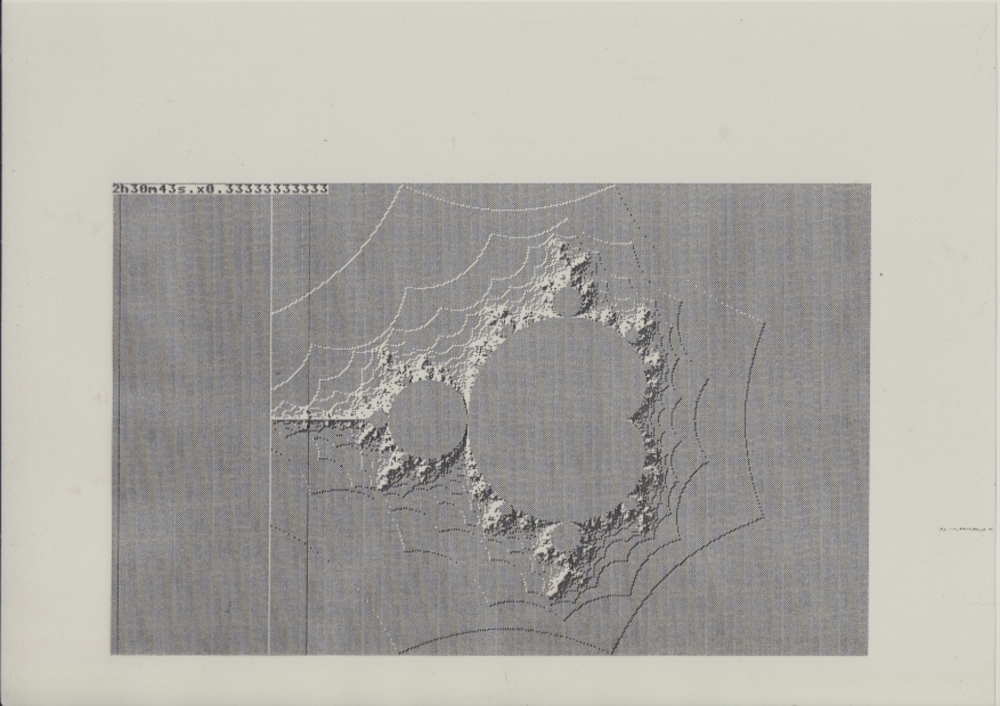

Notice the information in the top-left corner. This plot took me two and a half hours to compute! (And the magnification is one third - in other words it is zoomed out.)

I wrote many Mandelbrot programs, including:
* [a program that allowed you to zoom in](scans/mandelbrot-listing3.png) to an area of interest selected by the mouse,
* [a program to make the algorithm run faster by using a recursive box division technique](scans/mandelbrot-listing4.png), and
* a program with menus that combined all the features into one grand design.

## More plots

I remember leaving these programs running overnight, then running over to the computer in the morning with anticipation to see the new image that had been produced. It was exciting to think that I might be the first to explore that particular part of the Mandelbrot Set.

Here is one sequence of zooms:

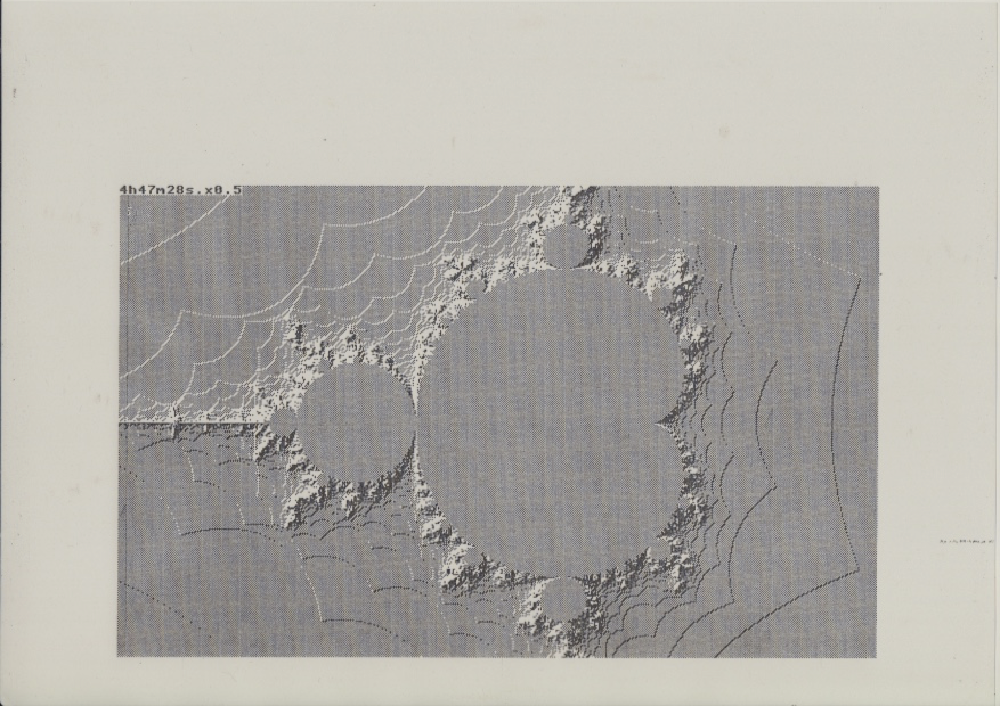

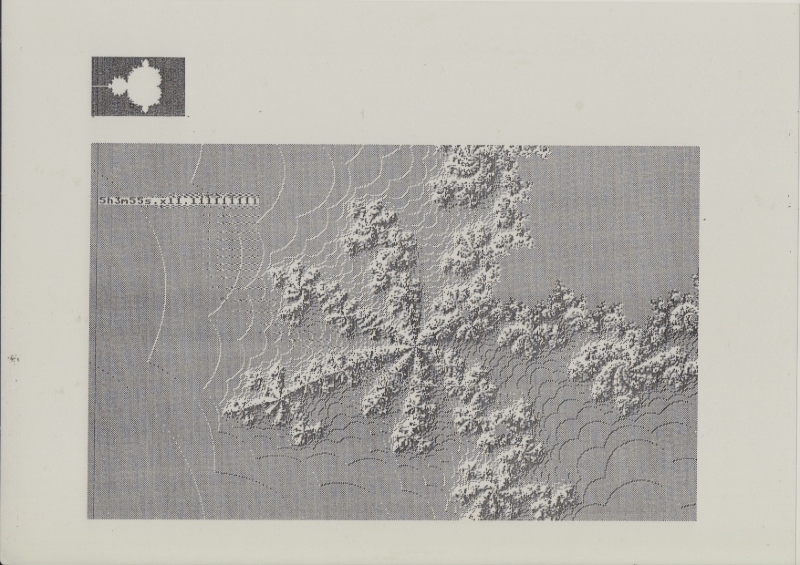

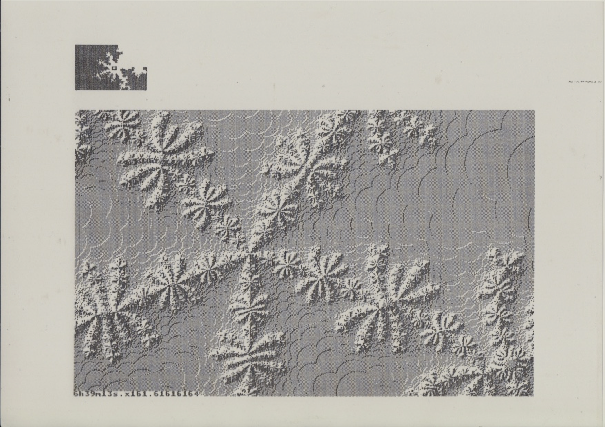

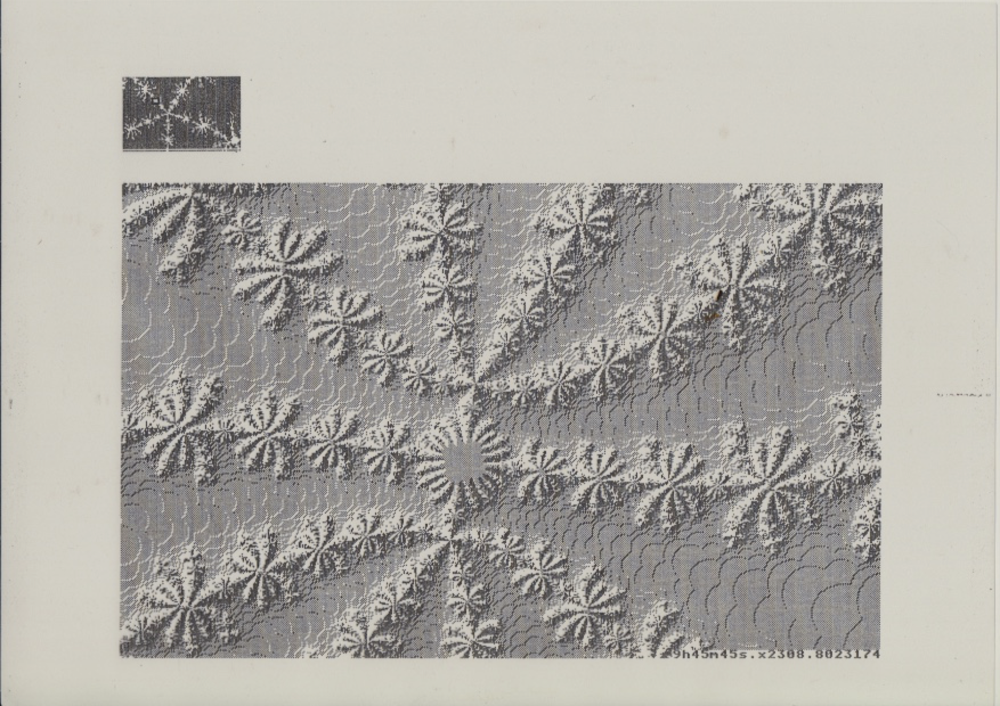

And another:

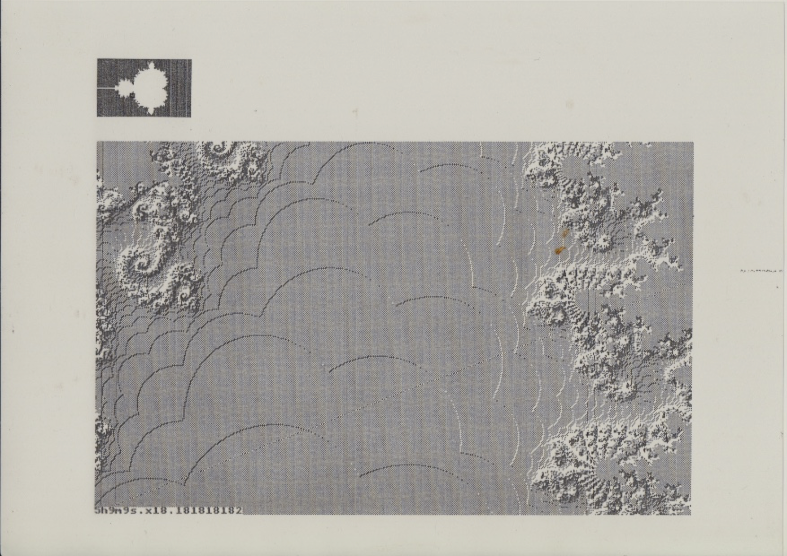

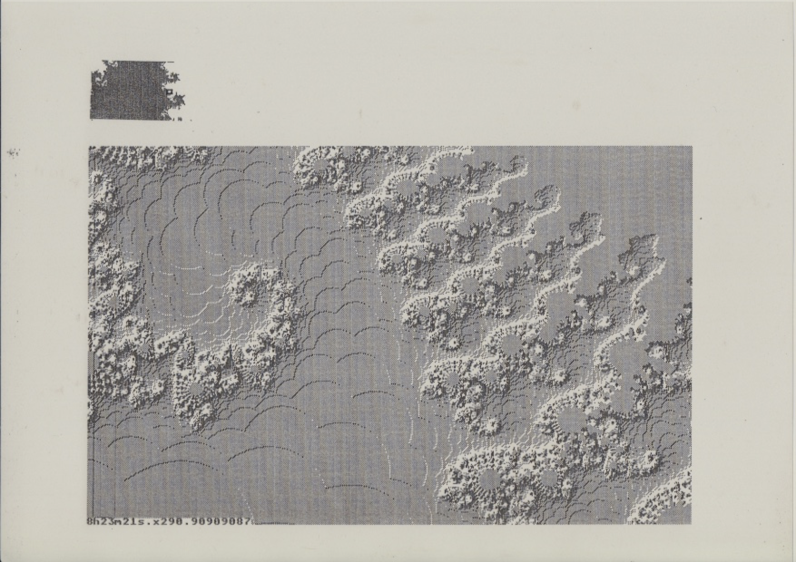

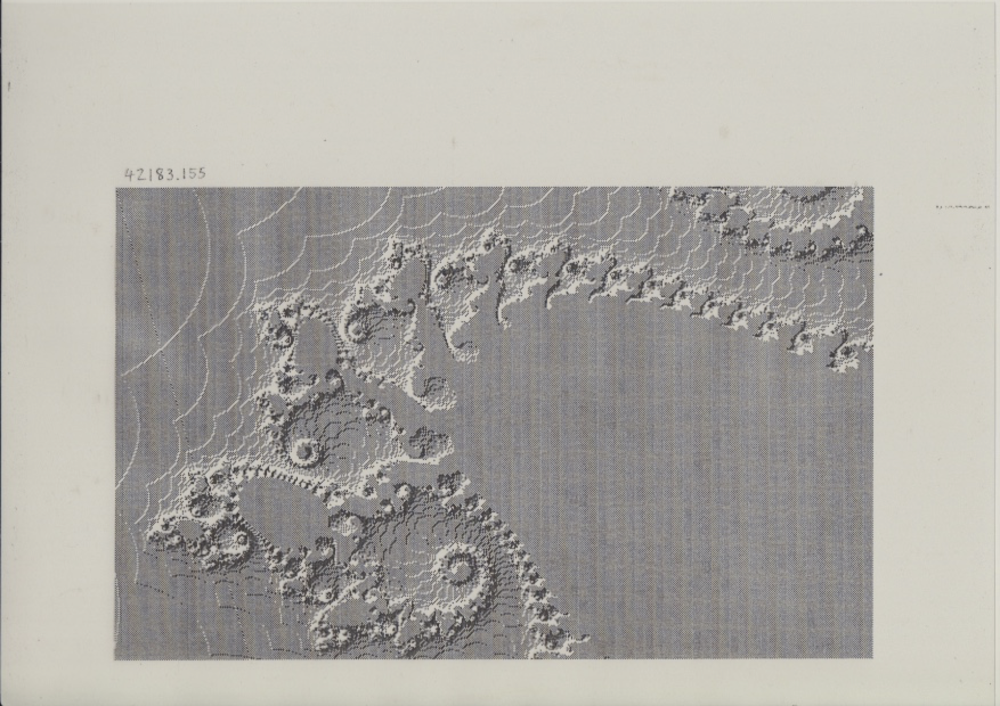

## A letter to Rollo Silver

I wrote a letter to subscribe to Amygdala, the fractal newsletter edited by Rollo Silver. In it I described some of the things I had been doing.

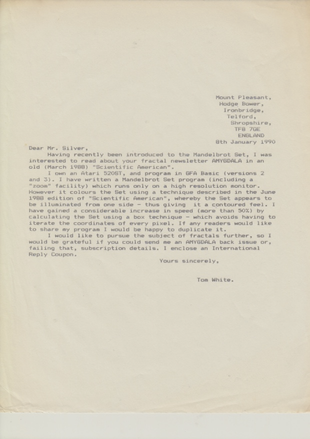

## Running the code in an emulator

Over thirty years later, in 2020, I used the [Hatari emulator](https://hatari.tuxfamily.org/) (version 2.3.0) running on a Mac to rerun some of the code I wrote back in 1989.

Here are a few notes about how I got it running:
* In preferences, I set the resolution to display 640 by 480, ("Atari Screen" -> "Extended resolutions").
* After typing in the program listing ([`MANDBROT.LST`](MANDBROT.LST)), I had to convert the file line endings (to `\r\n`):
```bash
brew install unix2dos
unix2dos MANDBROT.LST
```
* I downloaded GFA Basic 3.6 from [here](https://sites.google.com/site/stessential/development/gfa-basic).
* I created a disk image (containing GFA Basic and my program) for the ST to access as follows
```bash
unzip archive/GFA36TT.zip -d disk
cp MANDBROT.LST disk/gfatt36/
```
* In Hatari preferences ("Disks" -> "Hard Disks") I chose the _disk/gfatt36_ directory just created as the GEMDOS drive, so it would be exposed as the C hard drive on the ST desktop.
* I started Hatari, double clicked on "DISK C", then double clicked on "GFABASIC.PRG".
* After starting GFA Basic, I clicked on the `Merge` menu to load the ASCII format listing, and selected `MANDBROT.LST`.
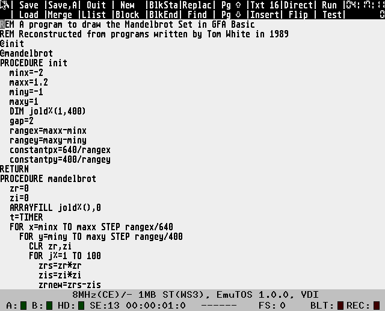
* Finally I clicked on `Run` (Shift-F10) and watched the program render the Mandelbrot Set! (It took a few hours...)
* I captured the output with File -> Capture -> Screen. (Clicking on `Flip` in the GFA Basic menu allows you to flip back to the program output.)

This was the result:

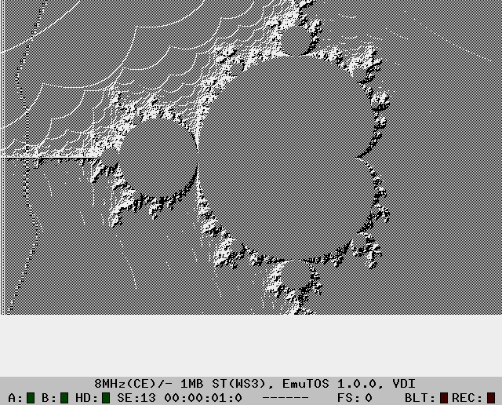
